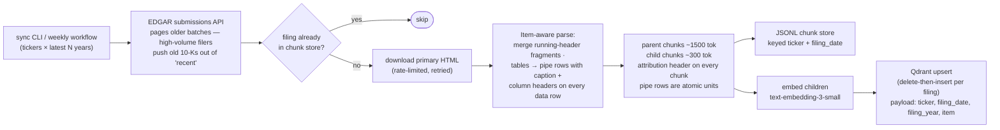
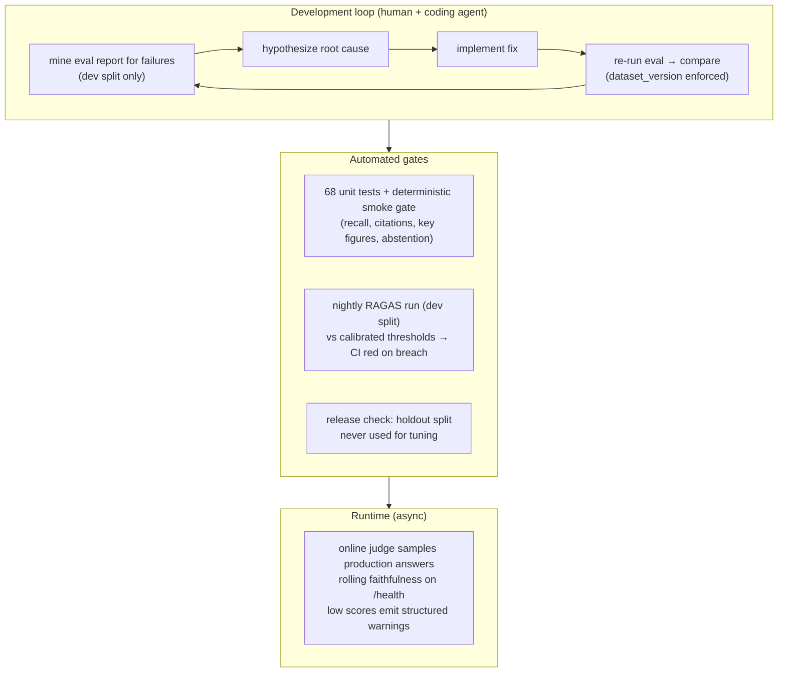

# rag-sec — Detailed Architecture & Workflow-Pattern Analysis

The README diagram shows the happy path. This document shows the real
control flow — every branch, gate, and async side-effect — and classifies
the system against the standard agentic-workflow patterns (single call,
sequential/prompt-chaining, parallelization, routing, evaluator/review
loop, orchestrator-workers a.k.a. agent-as-tool).

## Verdict: a composite workflow — not an agent

| Pattern | Present? | Where it lives in rag-sec |
| --- | --- | --- |
| **Single call** | No | Four distinct LLM roles per request path: planner (gpt-4o-mini), generator (gpt-4o), online judge (mini, sampled), memory extractor (mini, chat only) |
| **Sequential (prompt chaining)** | Yes — the backbone | Fixed chain `plan → retrieve → generate`, with programmatic gates between stages (cache hit → return; empty contexts → abstain) |
| **Routing** | **Yes — the dominant pattern** | The planner is a classic router: one cheap LLM call classifies intent and extracts entities, and *code* dispatches to one of three retrieval strategies **and** one of three generation prompts. Replaced the legacy system's hard-coded per-question routing |
| **Parallelization** | Yes — inside retrieval | Three independent fan-outs: dense ∥ BM25 per query phrasing; multi-query paraphrases concurrently; per-ticker sub-retrievals via `asyncio.gather`. Aggregation is Reciprocal Rank Fusion — a rank-voting aggregator |
| **Evaluator / review loop** | Yes — but **asynchronous, never inline** | The online judge scores sampled production answers *after* the response ships (fire-and-forget); the RAGAS harness + nightly CI thresholds form the development-time review loop (diagnose → fix → measure). There is deliberately no inline generate→critique→regenerate cycle |
| **Orchestrator-workers / agent-as-tool** | No — at runtime | No LLM chooses tools or control flow at request time; orchestration is code. (The *development process* used a coding agent, and the roadmap — MCP tool exposure, LangGraph multi-step analysis — is where this pattern would enter) |

**Why not an agent?** The task is well-defined: every question follows
plan → retrieve → generate. Fixed control flow buys deterministic latency
(~6 s), deterministic cost (~$0.02), stage-level tracing, and — critically —
evaluability: you can attribute a failure to a specific stage because the
stages are always the same. An autonomous agent earns its complexity when
the path through the task is unknown; here it isn't.

**Why no inline review loop?** A generate → judge → regenerate cycle would
roughly double latency and cost per answer for a system already at 0.92
holdout faithfulness. The same quality pressure is applied where it's
cheap: asynchronously on sampled traffic (drift detection) and offline in
CI (regression gates). If faithfulness requirements ever exceed what the
pipeline delivers, an inline critique pass on the *numeric* intent only
would be the surgical place to add it.

---

## 1 · Request path (`POST /query`, `/chat/{session}` — sync or SSE)

```mermaid
flowchart TD
    subgraph EDGE["EDGE — FastAPI middleware (code, no LLM)"]
        REQ([HTTP request]) --> AUTH{X-API-Key valid?}
        AUTH -- "401 / 403" --> REJ([reject])
        AUTH -- ok --> RATE{per-key rate limit}
        RATE -- "429 + Retry-After" --> REJ2([reject])
        RATE -- ok --> HIST[load session history + user memory facts]
        HIST --> CACHE{answer cache hit?<br/>key = collection + prompt_version + question<br/>skipped if history or user context}
        CACHE -- hit --> CACHED([return cached answer, cached=true])
    end

    CACHE -- miss --> PLAN

    subgraph PLANNER["PLAN — the ROUTER (1 × gpt-4o-mini, JSON mode)"]
        PLAN["classify intent: factual | reasoning | comparison<br/>extract tickers[] and years[]<br/>rewrite to standalone query + 2 paraphrases<br/>(history-aware: resolves pronouns)"]
        PLAN --> PFAIL{JSON parse ok?}
        PFAIL -- no --> PFALL["fallback plan:<br/>factual, all tickers, raw question"]
        PFAIL -- yes --> ROUTE
        PFALL --> ROUTE
    end

    ROUTE{route on intent}

    subgraph RETRIEVAL["RETRIEVE — PARALLELIZATION inside each branch"]
        ROUTE -- factual / numeric --> F0
        ROUTE -- reasoning --> R0
        ROUTE -- comparison --> C0

        subgraph FACT["precise mode"]
            F0["fiscal→filing year mapping per ticker<br/>(drop filter if nothing survives — never silently empty)"]
            F0 --> F1["per phrasing, concurrently:<br/>dense top-50 (Qdrant) ∥ BM25 top-50"]
            F1 --> F2["RRF fusion (rank-based, k=60)"]
            F2 --> F3["Cohere cross-encoder rerank top-40<br/>keep 10 · score floor 0.30 with min_keep=4<br/>(tenacity retries → degrade to RRF order)"]
        end

        subgraph REAS["reasoning mode — NO reranker"]
            R0["per ticker (all if unspecified), concurrently:"]
            R0 --> R1["dense ∥ BM25 → RRF"]
            R1 --> R2["keep top-12 children by fusion rank<br/>(reranker measured harmful to inference)"]
        end

        subgraph COMP["per-ticker mode"]
            C0["for each named ticker, concurrently:"]
            C0 --> C1["filtered dense ∥ BM25 → RRF → rerank top-5"]
            C1 --> C2["merge per-ticker context blocks<br/>(source diversity guaranteed by construction)"]
        end

        F3 --> EXP
        R2 --> EXP
        C2 --> EXP
        EXP["child → parent expansion<br/>dedupe, order by best child score, cap 6 parents"]
    end

    EXP --> GATE{any contexts?}
    GATE -- no --> ABSTAIN(["'not available in the provided documents'"])
    GATE -- yes --> GEN

    subgraph GENERATION["GENERATE — 1 × gpt-4o, prompt routed by intent"]
        GEN["factual prompt: affirmative opener, exact figures, no unit<br/>conversion, hard-abstain rules, cite TICKER + Item<br/>reasoning prompt: evidence/inference separation, grounded-only<br/>comparison prompt: per-company grouping, per-filing attribution"]
        GEN --> STREAM{streaming?}
        STREAM -- SSE --> TOK["meta → delta* → done events"]
        STREAM -- sync --> ANS([cited answer + provenance + latency + $cost])
        TOK --> ANS
    end

    ANS --> POST

    subgraph ASYNC["POST-ANSWER — fire-and-forget (never blocks the response)"]
        POST["cache answer (if uncached path)"]
        POST -.-> JUDGE["online judge (sampled):<br/>claim-support scoring → judge.jsonl + /health stats"]
        POST -.-> MEM["memory extractor (chat + X-User-Id):<br/>confidence-gated user facts"]
        POST -.-> TRACE["trace export: spans + tokens + $ →<br/>JSONL / Langfuse / OTel (MultiSink)"]
    end
```

Pattern annotations: EDGE and gates are plain code; PLAN is the routing
pattern; RETRIEVAL branches each contain parallelization with RRF as the
aggregator; GENERATION completes the sequential chain; ASYNC is the
evaluator pattern running out-of-band.

---

## 2 · Ingestion pipeline (offline, idempotent per filing)

---

## 3 · The review loop (where the evaluator pattern actually lives)

The key design stance: the review loop wraps the *system*, not the
*request*. Quality pressure is continuous, but no user waits for it.

---

## 4 · Where the patterns would evolve next

- **Agent-as-tool arrives via the roadmap, not the pipeline**: exposing
  retrieval as an MCP tool makes rag-sec a *worker* for external
  orchestrators; multi-step analysis (screen → compare → summarize) would
  put a LangGraph orchestrator *above* this pipeline, calling it as a tool.
  The pipeline itself stays a workflow — that's what makes it a reliable
  tool for an agent to hold.
- **Inline review loop, if ever**: a single critique pass gated to the
  numeric intent (highest verification value per dollar), not a general
  regenerate loop.
