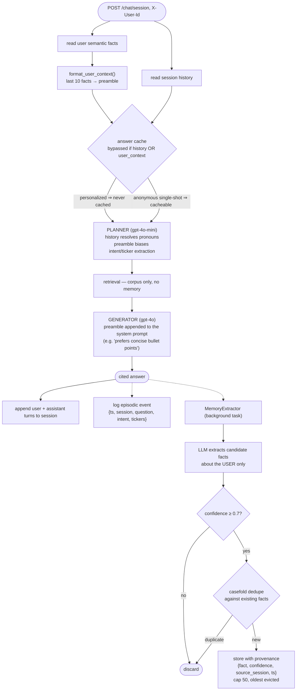

# rag-sec — Memory Design

Does this system have long-term memory? **Yes — two independent kinds,
and keeping them separate is the central design rule.** This document
specifies both, plus the short-lived state around them, the governance
that keeps them from poisoning answers, and an honest account of what is
deliberately absent.

## The one-sentence answer

rag-sec has **long-term domain memory** (the filing corpus — durable
knowledge about *companies*) and **long-term user memory** (semantic
facts + an episodic log — durable knowledge about *people*), separated by
hard architectural boundaries; plus short-term **session memory** that
expires. It does **not** have self-modifying procedural memory, memory
retrieval by similarity, or rolling conversation summarization.

## Memory taxonomy as implemented

| Layer | Contains | Lifetime | Backend | Injected into the prompt? |
| --- | --- | --- | --- | --- |
| **Domain / semantic knowledge** | 10-K text: 713 parents, 5,219 children, vectors + payloads | Until re-ingest (idempotent per filing) | Qdrant + JSONL chunk store | Yes — retrieved per question; the *only* source of factual claims |
| **User semantic memory** | Durable facts about a user: role, format preferences, coverage focus | Indefinite until evicted (cap 50) or erased | `InMemoryUserMemory` / `RedisUserMemory` | Yes — last 10 facts as a preamble to planner + generator |
| **User episodic memory** | Event log: `{ts, session_id, question, intent, tickers}` | Rolling, cap 200 events | same stores | **No — write-only at inference time.** Readable only via `GET /memory/{user_id}` |
| **Session / working memory** | Verbatim last 10 turn-pairs of one conversation | 24 h TTL (Redis); process lifetime (in-process) | `sessions.py` | Yes — the planner reads it to resolve follow-ups into standalone queries |
| **Derived caches** | Answer cache, query-embedding cache | TTL 1 h, LRU 2048 | in-process or Redis | Not memory in the cognitive sense — memoization; listed because it interacts with personalization (below) |

Two things this table is deliberately explicit about: the corpus *is* a
memory system (people often forget to count it), and the episodic log is
**stored but not recalled** — see [Honest gaps](#honest-gaps).

## The cardinal rule: two memories that must never mix

> The corpus stores facts **about companies**. User memory stores facts
> **about people**. A fact from one must never enter the other.

This is the pollution rule from the original architecture review, and
it's enforced in code, not merely in a prompt:

- The extraction prompt forbids extracting facts about companies or
  filings (`memory.py`, `EXTRACTION_PROMPT`).
- User facts enter as a **system-prompt preamble**, never as retrieved
  context — so they can never be cited as evidence. Citations can only
  come from corpus chunks.
- The stores are physically separate: user memory lives in Redis keys
  (`secrag:memfacts:*`) or a process dict; corpus knowledge lives in
  Qdrant and the chunk store. There is no code path that writes one from
  the other.

Why it matters: if a user says "NVIDIA's margins are collapsing" and that
sentence became durable memory, the system would begin treating a user's
opinion as background truth in later answers — the failure mode that turns
a grounded RAG system into a confident rumour engine.

## Read and write paths

Dotted edges are fire-and-forget: memory writes never block or delay the
user's answer, and a failed extraction is logged and swallowed
(`MemoryExtractor.extract` can never raise into the request).

### Write gates, in order

1. **Opt-in** — no `X-User-Id` header, no user memory at all. `/query`
   (single-shot) doesn't accept the header: it is memoryless by design,
   which is also what makes its answers cacheable across users.
2. **Scope gate** — the extraction prompt admits only user-attributes;
   company facts and one-off situational details are rejected by
   instruction.
3. **Confidence gate** — `SECRAG_MEMORY_CONFIDENCE_FLOOR`, default 0.7.
4. **Dedupe gate** — case-insensitive exact match against stored facts.
5. **Capacity gate** — 50 facts / 200 events per user, oldest evicted.
6. **Provenance stamp** — every fact carries `source_session` and `ts`,
   so any stored belief is traceable to the conversation that created it.

### Read rules

- Facts are injected as `"Known about this user (apply when relevant): …"`
  — advisory, not instruction. The generator's grounding rules still
  outrank it, so a preference can change *form* but never *claims*.
- Only the **last 10** facts are injected — a fixed context budget.
- **Personalized answers are never cached.** `_answer_cache_key()`
  returns `None` whenever `user_context` or history is present, so one
  user's tailored answer can never be served to another. Verified in
  `pipeline.py`.

## Governance and privacy

| Control | Mechanism |
| --- | --- |
| Visibility | `GET /memory/{user_id}` returns every stored fact — with its confidence, source session, and timestamp — plus the last 20 episodic events |
| Erasure | `DELETE /memory/{user_id}` clears facts and events atomically; logged as a structured audit event |
| Minimization | Extraction prompt forbids sensitive personal data; only durable, work-relevant attributes are eligible |
| Isolation | Per-user keys; no cross-user reads; cache bypass prevents leakage through shared answers |
| Auditability | Every fact is provenance-stamped; every memory write is logged with the user id and count |

Verified end-to-end during Phase 3: a preference stated in one session
("I prefer concise bullet points") was applied in a **new session**
without restating it, and `DELETE` removed all traces.

## What is deliberately absent

| Not built | Why |
| --- | --- |
| **Procedural / self-modifying memory** | The system never rewrites its own prompts or retrieval policy at runtime. Policy changes go through eval + CI gates — an unevaluated self-modification is a silent regression |
| **Graph memory** (entity graph across filings) | Real value for portfolio questions, but a project of its own; parked with a reason rather than half-built |
| **Memory-augmented retrieval** | User facts never join the retrieval query. Personalizing *what evidence is retrieved* risks confirmation-bias answers in a domain where the evidence must be neutral |
| **Cross-user / organizational memory** | Requires an access-control model (who may see whose facts) that a single-tenant demo can't honestly implement |

## Honest gaps

These are real limitations of the current implementation, not
rationalizations:

1. **Episodic memory is write-only.** Events are logged and exposed via
   the API, but never recalled into a prompt. Nothing today says "you
   asked about JPMorgan's credit risk last week." Closing this needs a
   retrieval rule (recency? topical match?) and a context budget.
2. **No similarity retrieval over memory.** Facts are a linear list; the
   last 10 are injected regardless of relevance to the current question.
   Fine at a 50-fact cap; it breaks down at hundreds — the point at which
   memories should live in their own vector collection and be retrieved,
   not dumped.
3. **No summarization of long conversations.** Sessions truncate to 10
   turn-pairs; turn 11 silently loses turn 1. A rolling summary would
   preserve early context — the standard fix, not yet implemented.
4. **No decay, staleness, or conflict resolution.** Facts persist until
   evicted by the cap or erased. "Prefers tables" and "prefers prose" can
   coexist if stated months apart; dedupe is exact-match only. Real
   systems need recency weighting and contradiction handling.
5. **`X-User-Id` is trusted, not authenticated.** It's a header, not a
   claim bound to the API key. Fine for an internal tool; a client
   deployment must derive the user identity from SSO/JWT.
6. **Memory behavior is not in the eval suite.** Every other quality
   claim in this project is measured; memory's is verified by a manual
   end-to-end check. The honest fix is a small memory-specific eval —
   does a stated preference persist across sessions, does erasure work,
   does a company "fact" ever leak into user memory?

## Roadmap, in the order I'd build it

1. **Memory eval questions** — close gap 6 first, on principle: no
   quality claim without a measurement.
2. **Episodic recall** — make the event log readable by the planner
   ("continuing from your NVDA supply-chain thread"), gated by a context
   budget.
3. **Rolling session summary** — a background summarization pass once a
   conversation exceeds the turn cap.
4. **Vector-backed memory** at scale — a separate collection, retrieved
   by relevance, still never mixed with corpus chunks.
5. **Decay + contradiction handling** — recency weighting and an
   LLM-adjudicated merge when a new fact conflicts with a stored one.
6. **Identity binding** — user id from the auth layer, not a header.

Related: [architecture.md](architecture.md) for where memory sits in the
request path; [phase3.md](phase3.md) for the implementation history.
